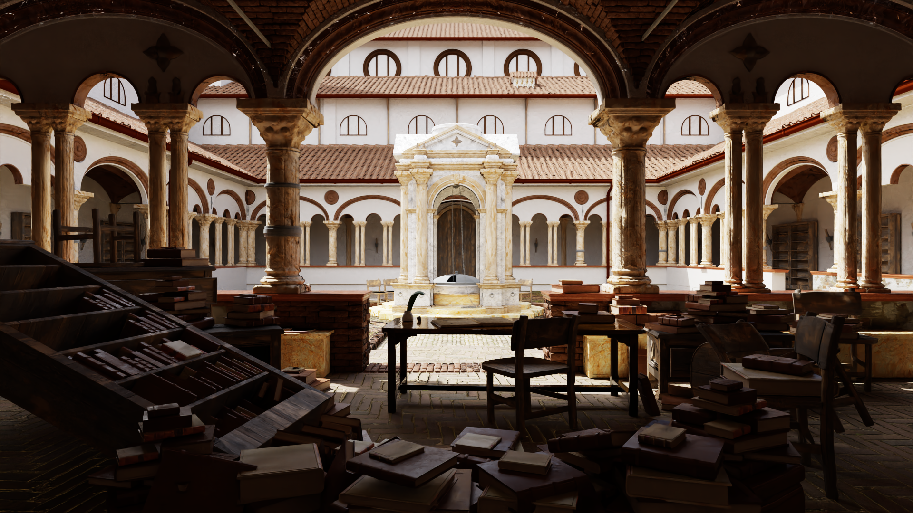

# Lupin: A WGPU Path Tracing Library
**Warning**: This project uses [WGPU](https://wgpu.rs/) features that are currently experimental, so use at your own risk.

**Lupin** is a data-oriented library for fast photorealistic rendering on the GPU with WGPU. It's meant to be simple and C-like, and while it supports hardware raytracing, it still provides a software implementation for compatibility with older devices. It is mainly designed for research and testing.

- Physically based path tracing with multiple importance sampling (MIS).
- Naive path tracing and other algorithms are also supported.
- Russian Roulette path termination.
- Progressive and tiled rendering.
- Emissive mesh lights and HDRIs.
- Materials: Matte, glossy, reflective, transparent, refractive, subsurface, volumetric, with GLTF-PBR compatibility.
- Support for emission-maps, metallic and roughness maps and normal-maps.
- Support for different aperture, aspect ratio, focal length, and orthographic cameras.
- Optional GPU Denoising with [OIDN](https://www.openimagedenoise.org/).

During the development of this project I've used [Yocto/GL](https://github.com/xelatihy/yocto-gl) as a reference for the theoretical foundations of material models and light sampling. This project also uses its scene format and scenes (with permission by its author, who I know personally).

Scene serialization could be implemented using **lupin_loader**, or a custom loader which can use **Lupin**'s scene building API.

## Showcase:

Scene by Carlo Bergonzini.


Scene by Christophe Seux.


Scene by Amazon Lumberyard.


Scene by Jan-Walter Schliep, Burak Kahraman, Timm Dapper.

https://github.com/user-attachments/assets/ef2bbb75-690a-4a81-b201-fae6343ec184

(Full video [here](https://www.youtube.com/watch?v=EcDY_xUkNxs)).

Depending on the hardware and on the complexity of the scene, the user can likely move the camera and visualize the path traced scene in a pseudo-real-time fashion. Try it yourself by downloading the latest release, which includes **Lupin Viewer** and a few test scenes! More complex scenes can be found [here](https://github.com/LeonardoTemperanza/lupin_scenes).

## API Usage:
Here's a simple example of loading a scene and producing a path traced image:
```rust
use lupin_pt as lp;
use lupin_loader as lpl;
use lupin_pt::wgpu as wgpu;

fn main()
{
    // Initialize WGPU
    let (device, queue, _) = lp::init_default_wgpu_context_no_window();
    // Initialize lupin resources (all desc-type structs have reasonable defaults)
    let pathtrace_res = lp::build_pathtrace_resources(&device, &lp::BakedPathtraceParams {
        with_runtime_checks: false,  // This greatly affects render time!
        max_bounces: 8,
        samples_per_pixel: 5,
    });

    // Load/create the scene.
    let (scene, cameras) = lpl::build_scene_cornell_box(&device, &queue, false);
    // let (scene, cameras) = lpl::load_scene_yoctogl_v24("scene_path", &device, &queue, false).unwrap();
    // Set up double buffered output texture for accumulation
    let mut output = lp::DoubleBufferedTexture::create(&device, &wgpu::TextureDescriptor {
        label: None,
        size: wgpu::Extent3d { width: 1000, height: 1000, depth_or_array_layers: 1 },
        mip_level_count: 1,
        sample_count: 1,
        dimension: wgpu::TextureDimension::D2,
        format: wgpu::TextureFormat::Rgba16Float,
        usage: wgpu::TextureUsages::STORAGE_BINDING | wgpu::TextureUsages::TEXTURE_BINDING |
               wgpu::TextureUsages::COPY_SRC | wgpu::TextureUsages::COPY_DST |
               wgpu::TextureUsages::RENDER_ATTACHMENT,
        view_formats: &[]
    });

    // Accumulation loop. This is highly recommended as opposed to increasing the sample
    // count in lp::BakedPathtraceParams, because shader invocations that run for too long
    // will cause most current OSs to issue a complete driver reset. Accumulation is useful
    // as a way to break-up the GPU work into multiple invocations.
    let num_accums = 200;
    for accum_idx in 0..num_accums
    {
        lp::pathtrace_scene(&device, &queue, &pathtrace_res, &scene, output.front(), Default::default(), &lp::PathtraceDesc {
            accum_params: Some(lp::AccumulationParams {
                prev_frame: output.back(),
                accum_counter: accum_idx,
            }),
            tile_params: None,
            camera_params: cameras[0].params,
            camera_transform: cameras[0].transform,
            force_software_bvh: false,
            advanced: Default::default(),
        });
        output.flip();
    }
    output.flip();

    lpl::save_texture(&device, &queue, std::path::Path::new("output.hdr"), output.front()).unwrap();
}
```

To run this example: `cargo run --release --bin=example1`.
For more information see the project's [crates.io page](https://crates.io/crates/lupin_pt).

## Support Matrix:
|         | DX12 | Vulkan | Metal |
|---------|------|--------|-------|
| Windows |  ⏳* |  ✅    |   /   |
| Linux   |   /  | ✅    |   /   |
| Mac     |   /  |    /   |  ⏳**  |

⏳: Automatically supported once [WGPU](https://wgpu.rs/) implements certain features.

*: This can run, but only with software raytracing.

**: Currently does not support GPU denoising. Will fall back to CPU denoising. Other than that, needs upstream WGPU work to be able to run at all.

## Build:

Just add the following line to your `Cargo.toml`:
```toml
[dependencies]
lupin_pt = "*"
```

This library optionally supports denoising using [OIDN](https://www.openimagedenoise.org/). To enable denoising, make sure to add `features = [ "denoising" ]` to your `Cargo.toml`. **OIDN** has to be installed separately (binaries can be found [here](https://github.com/RenderKit/oidn/releases)). Make sure CUDA/HIP (NVIDIA/AMD) is installed on your system for proper GPU denoising.

Other features are `"denoise-force-disable-shared-device"`, which forces the CPU denoising fallback, and `"force-swrt"` which acts like the device doesn't support hardware raytracing, even if it does.
